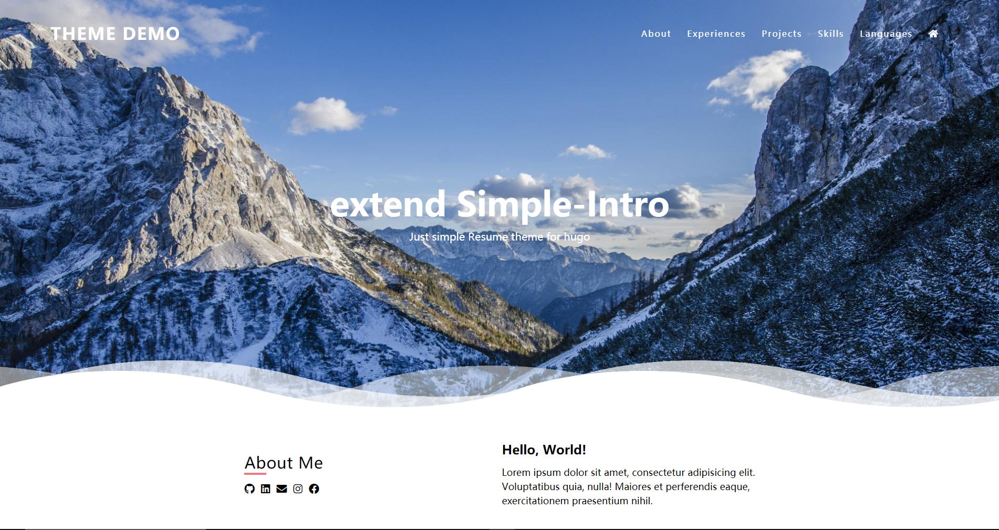

# Extend Simple Intro

[](https://github.com/SidneyLYZhang/ExtendIntro/releases)
[](https://gohugo.io/)
[](https://github.com/SidneyLYZhang/ExtendIntro/blob/main/LICENSE)

English README | [简体中文说明](https://github.com/SidneyLYZhang/ExtendIntro/blob/main/README_zh-cn.md)

a simple theme for hugo that is modified from [SimpleIntro](https://github.com/gangjun06/SimpleIntro)



# Live Demo

https://gangjun06.github.io/SimpleIntroDemo

# Get Started

```bash
hugo new site <site-name>
cd <site-name>
git submodule add https://github.com/SidneyLYZhang/ExtendIntro themes/ExtendIntro
```

You can also build Exsample Site locally:

```bash
cd themes/ExtendIntro
hugo server --source=exampleSite
```

# Configuration

Check out the config files included on the [exampleSite](exampleSite)

# Credits

| Name                                | License     | Description    |
| ----------------------------------- | ----------- | -------------- |
| [SimpleIntro](https://github.com/gangjun06/SimpleIntro) | Apache-2.0 License | Original template |
| [devicons/devicon](https://github.com/devicons/devicon)           | MIT License | Demo Site Icon |
| [tailwindlabs/tailwindcss](https://github.com/tailwindlabs/tailwindcss) | MIT License | Css Library    |

# ETC.

I like this theme [SimpleIntro](https://github.com/gangjun06/SimpleIntro) so much, 
but it's a little simple, so I've modified it, and make it to generate as simple but richer resumes as possible.

I've added some modules into theme, including 'experiences' and 'languages'.