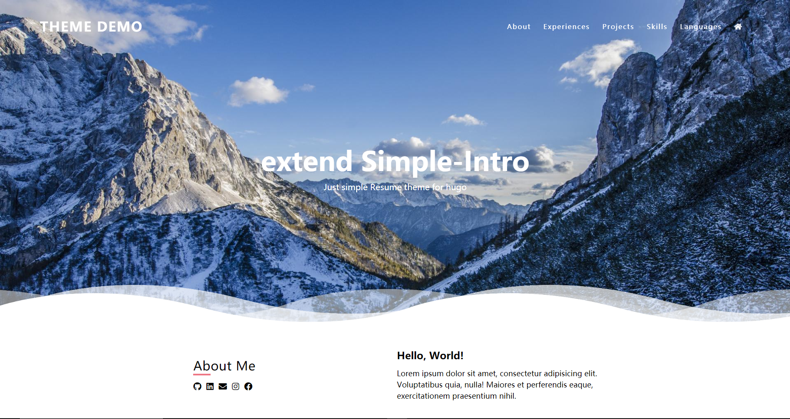

# Extend Simple Intro

一个修改自 [SimpleIntro](https://github.com/gangjun06/SimpleIntro) 的Hugo模板



# Live Demo

https://gangjun06.github.io/SimpleIntroDemo

# Get Started

安装模板：

```bash
hugo new site <site-name>
cd <site-name>
git submodule add https://github.com/SidneyLYZhang/ExtendIntro themes/ExtendIntro
```

可以在本地运行实例网站:

```bash
cd themes/ExtendIntro
hugo server --source=exampleSite
```

# Configuration

可以在实例内容 [exampleSite](exampleSite) 中看到配置文件。

# Credits

| Name                                | License     | Description    |
| ----------------------------------- | ----------- | -------------- |
| [SimpleIntro](https://github.com/gangjun06/SimpleIntro) | Apache-2.0 License | Original template |
| [devicons/devicon](https://github.com/devicons/devicon)           | MIT License | Demo Site Icon |
| [tailwindlabs/tailwindcss](https://github.com/tailwindlabs/tailwindcss) | MIT License | Css Library    |

# 补充信息

我超喜欢 [SimpleIntro](https://github.com/gangjun06/SimpleIntro) 这个简历主题，
但是这个主题有点太简单了，而且灵活性略有不足~所以我在其基础上做了一些修改，增加了一些简历模块，
希望可以适应更多的使用情况。